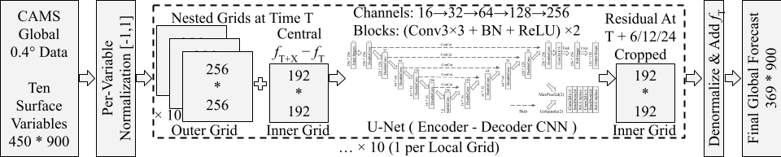
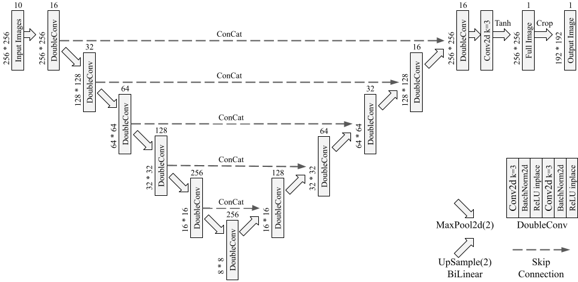

# PM Forecasting with U-Net (ICLR26 ML4RS Workshop)

Official implementation of a nested‑grid residual learning framework built on a lightweight U‑Net for global particulate matter (PM) forecasting using CAMS atmospheric composition data.

## Scope

- **Targets:** PM1, PM2.5, PM10
- **Lead times:** 6 / 12 / 24 hours
- **Data source:** CAMS Global Atmospheric Composition Forecasts (IFS/4D‑Var)
- **Coverage:** Global, excluding polar caps (74°N–73.6°S)

## Overview

- Global domain decomposed into overlapping local grids.
- U‑Net predicts residual pollutant evolution per grid.
- Local predictions are stitched into global forecasts.


*Figure 1. Overview of Nested-Grid Residual Learning Framework using U-Net Architecture.*


*Figure 2. Lightweight U‑Net architecture used for residual prediction.*

## Setup

**Conda**
```
conda env create -f environment.yml
conda activate venv
```

**Pip**
```
pip install -r requirements.txt
```

## Usage

**Download data**
```
python download.py
```

**Preprocess data**
```
python preprocess.py
```

**Train models**
```
python unet_train.py
```

**Evaluate models**
```
python unet_test.py
```

## Outputs

- Model checkpoints are saved to models/.
- Evaluation metrics are saved to metrics/.

**Checkpoint naming**

`unet_<leadtime>_<target>_<grid>.pt`
